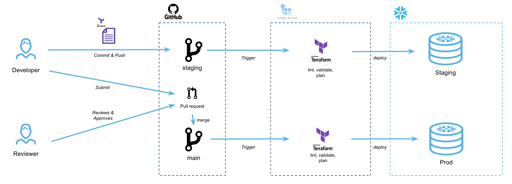

# CI/CD pipeline with Snowflake
Demo of a simple CI/CD pipeline deployed onto Snowflake with Terraform

[](https://github.com/sfc-gh-sekim/cicd-snowflake-with-terraform-demo/actions/workflows/snowflake-terraform-demo-prod.yml)
[](https://github.com/sfc-gh-sekim/cicd-snowflake-with-terraform-demo/actions/workflows/snowflake-terraform-demo-staging.yml)



## Prerequisites 

### Snowflake

You will need a Snowflake account, along with a user with `ACCOUNTADMIN` role. In a true production setting consider setting up a role with least privilege permissions.

Key pair authentication is used to authenticate to Snowflake. Checkout the [official docs](https://docs.snowflake.com/en/user-guide/key-pair-auth#configuring-key-pair-authentication) for instructions on setting up key pair authentication for a user.

#### TF_DEMO_READER Role

This Terraform project creates grants for a `TF_DEMO_READER` custom role, which is not created or managed by Terraform in this case. To create this in your Snowflake account before deploying:

```
create role TF_DEMO_READER;

--Grant to this to a user of your choice
grant role TF_DEMO_READER to user MY_ROLE;
```

### Terraform

If you'd like to develop locally, you can install terraform. See instructions for your platform [here](https://developer.hashicorp.com/terraform/tutorials/aws-get-started/install-cli)


### Github Actions

If you'd like to see Github actions workflow in action, fork this repository.

#### Secrets

The Github Actions workflows authenticate to Snowflake via secrets uploaded to Github Actions. On your forked repo, set up the following Repository Secrets:

- AWS_ACCESS_KEY_ID: For authenticating with AWS
- AWS_SECRET_ACCESS_KEY: For authenticating with AWS
- SNOWFLAKE_PRIVATE_KEY: This is your private key you use to authenticate to Snowflake via key-pair authentication


